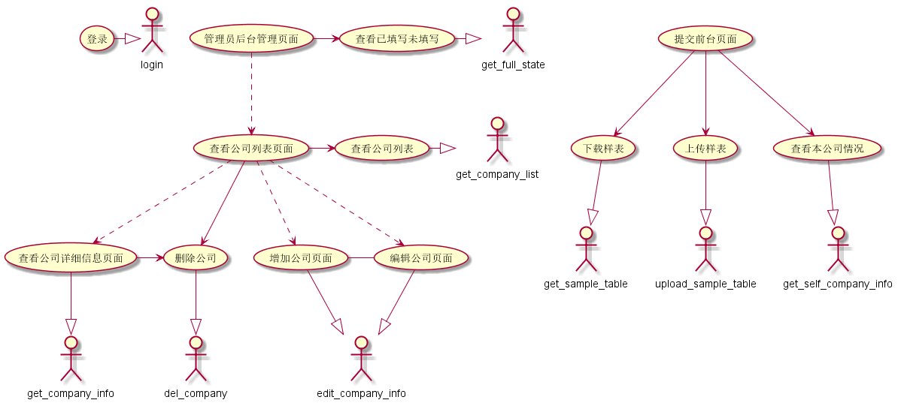

## 借口约定
登录:  

- login(username: int, password: str)
- -> login_result: LoginResult
- 使用者登录, 成功返回login_token, 失败无token.

获取样例表:

- get_sample_table()
- -> file: File
- 填表者获取用于填写的样例表

上传样例表:

- upload_sample_table(file: File)
- -> parse_result: ParseResult
- 填表者上传一个表格并返回是否解析成功

获取本公司信息:

- get_self_company_info()
- -> info: CompanyInfo
- 填表者获取本公司的信息返回公司信息类

查看已填写未填写:

- get_full_state()
- -> info: SummaryInfo
- 管理员获取所有公司的填写摘要

查看公司列表: 

- get_company_list(page: int, page_size: int = 100, order_config OrderConfig)
- -> info: CompanyListInfo
- 管理员按照页和每页数量获取公司列表

查看公司详细信息:

- get_company_info(id: int)
- -> info: CompanyInfo
- 管理员获取某个公司的详细信息

删除公司:

- del_company(id: int)
- -> delete_state: pymongo.results.DeleteResult
- 管理员删除公司并返回删除结果

编辑公司信息:

- edit_company_info(info: CompanyInfo)
- -> edit_state: Union[
        pymongo.results.InsertOneResult, 
        pymongo.results.UpdateResult
    ]
- 管理员编辑/添加公司, 公司信息所指的id存在则进行编辑, 不存在则进行添加
